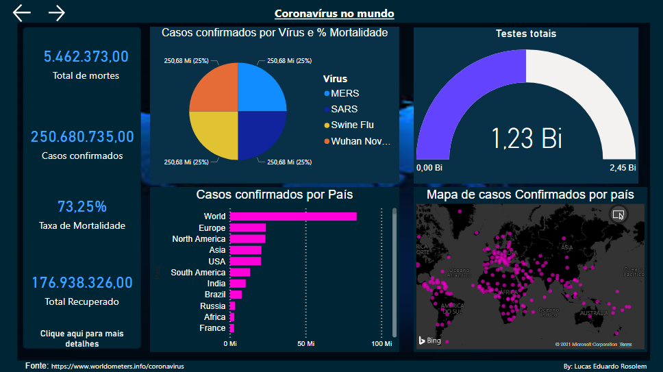
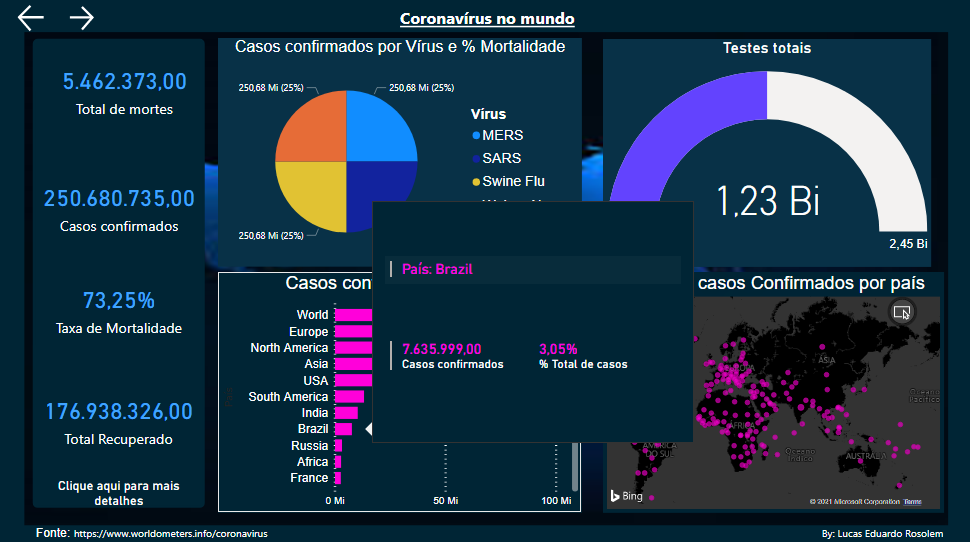
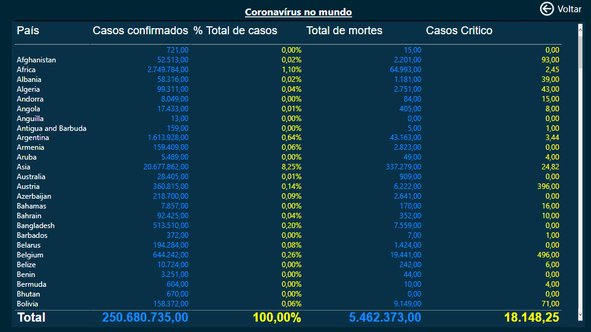
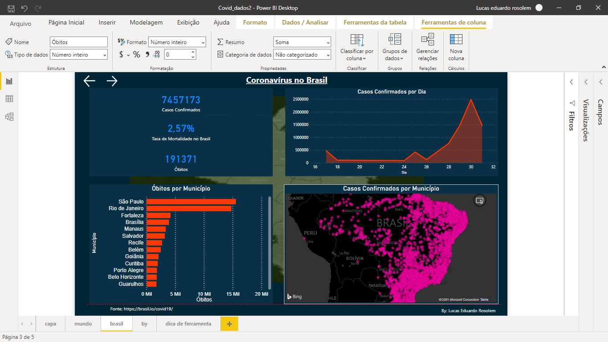

### Esse Dashboard feito com PowerBI Busca os dados dos casos do vírus na base de dados da web das Fontes: https://www.worldometers.info/coronavirus, que são dados Mundiais e os dados do Brasil da Fonte: https://brasil.io/covid19/.
### Ao utilizar o dashboard na maquina local, deve-se clicar no botão atualizar do aplicativo para o dashboard trazer os dados mais atualizados.

### Abaixo estão as imagens da aparência do Dashboard:

 

  

  

  

  

 ### 🛠 Tecnologias

As seguintes ferramentas foram usadas na construção do projeto:

- [PowerBI](https://powerbi.microsoft.com/pt-br/)
- [PPTX](https://www.office.com/launch/powerpoint)

