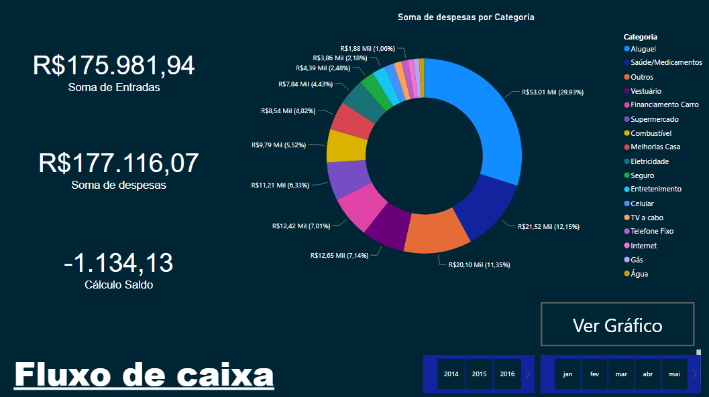
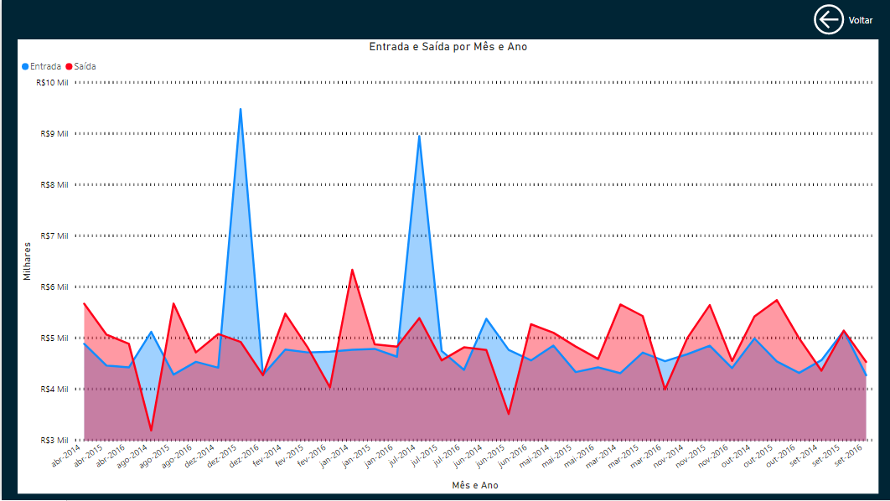

### Esse Dashboard feito com PowerBI é para analisar o fluxo de caixa de empresas os dados usados no projeto é fictício, a base de dados é buscada em um arquivo de excel.
### Abaixo estão as imagens da aparência do Dashboard:

 

  

  ### 🛠 Tecnologias

As seguintes ferramentas foram usadas na construção do projeto:

- [PowerBI](https://powerbi.microsoft.com/pt-br/)
- [EXCEL](https://office.live.com/start/Excel.aspx?ui=pt-BR)

 

 

